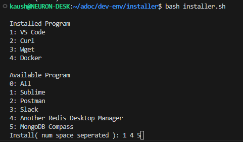

# Dev-Env

## Introduction

This project aims to simplify the installation process of necessary programs and provide a centralized location for storing various projects and files. By having everything in one place, it becomes easier to back up all your data and streamline the reinstallation process in case of a system failure or fresh installation.

## Project Structure

To set up the project, please follow these steps:

1. Clone this repository to the `~/adoc/dev-env` directory. This will serve as the main project directory.
2. Ensure that the `~/adoc` directory exists. If it doesn't, create it and navigate to it using the command `cd ~/adoc`.
3. After cloning the repository, your `~/adoc` directory should have the following structure:
```bash
├──~/adoc
  ├── dev-env (this repo)
  ├── proj
  | ├── work
  | └── personal
  |    ├── js
  |    └── go
  ├── keys
  |  └── aws
  |  | ├── ec2.pem
  |  | └── another-ec2.pem
  |  └── gcp
  |    └── key.pem
  └── mounts (may contain soft links from/to other directories)
```

This structure allows you to organize your projects, store encryption keys, and create symbolic links to external directories, if needed.

## Installing Available Program

To install the available programs, please follow these steps:

1. Change directory to `~/adoc/dev-env/installer` using the command: `cd ~/adoc/dev-env/installer`.
2. Run the following command: `bash installer.sh`. This will display a list of programs that you can install.



Select the programs you want to install by above prompts provided. To install multiple program use it space separated, Selecting `0` (All) will install all programs available.

## Backup

Although automated backup functionality is currently under development, you can take advantage of the centralized structure in `~/adoc` to manually back up your data easily. Once the automated backup feature is implemented, it will periodically back up the `~/adoc` directory to cloud storage services like Google Drive or OneDrive.

To ensure your data is backed up, you can manually create backups of the entire `~/adoc` directory or specific subdirectories using your preferred backup method.

Please note that it is essential to regularly back up your data to prevent data loss in case of system failures or other unforeseen circumstances.

## Conclusion

By following the setup instructions and utilizing the project structure provided by this repository, you can simplify the installation process of required programs and conveniently store your projects and files in one centralized location. Additionally, once the automated backup feature is implemented, you will have the peace of mind knowing that your data will be periodically backed up to a cloud storage service.

Feel free to customize the project structure or enhance the functionality as per your requirements.
